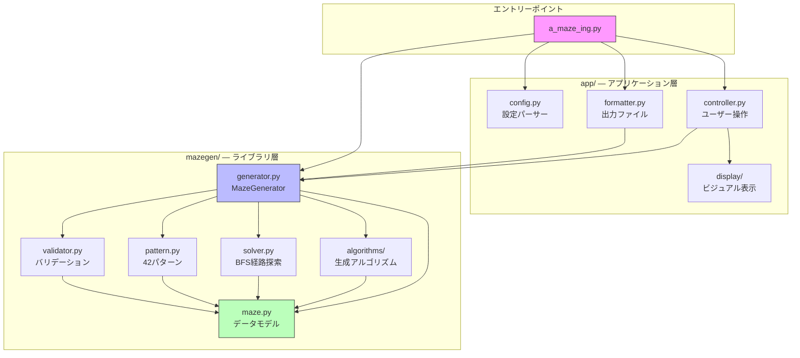
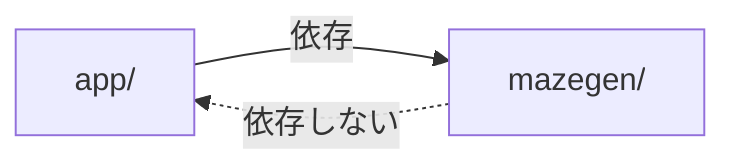
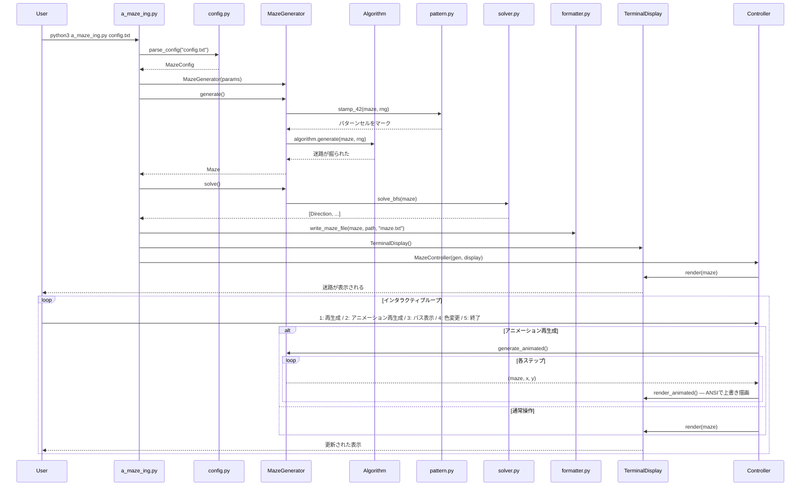

# アーキテクチャ

## 全体構成

このプロジェクトは**ライブラリ層**と**アプリケーション層**の2層に分離されています。



## なぜ2層に分けるのか？

```
mazegen/  →  純粋なロジックだけ。ファイルI/O・表示・設定なし。
app/      →  mazegen を使うアプリケーション固有のコード。
```

この分離により:

- `mazegen` は **pip でインストール**して他プロジェクトから使える
- `app` は `mazegen` に依存するが、**逆方向の依存はない**
- テストが書きやすい（ライブラリ単体でテスト可能）



## 実行フロー

プログラム実行時のデータの流れ:



## ディレクトリ構成

```
a_maze_ing/
├── a_maze_ing.py            # エントリーポイント（ここだけが main() を持つ）
├── config.txt               # デフォルト設定ファイル
├── Makefile                 # ビルド・実行の自動化
├── pyproject.toml           # パッケージビルド設定
│
├── mazegen/                 # ライブラリ（pip installable）
│   ├── __init__.py          # 公開 API のエクスポート
│   ├── maze.py              # ★ 全ての基盤: Direction, Cell, Maze
│   ├── generator.py         # MazeGenerator（ファサード）
│   ├── solver.py            # BFS 最短経路
│   ├── pattern.py           # "42" パターンスタンプ
│   ├── validator.py         # 迷路の整合性チェック
│   └── algorithms/          # 生成アルゴリズム群
│       ├── __init__.py      # レジストリ（名前 → クラス）
│       ├── base.py          # MazeAlgorithm 抽象基底クラス
│       ├── recursive_backtracker.py
│       └── kruskal.py
│
├── app/                     # アプリケーション層
│   ├── __init__.py
│   ├── config.py            # KEY=VALUE パーサー
│   ├── formatter.py         # 16進出力ファイルライター
│   ├── controller.py        # ユーザー操作ループ
│   └── display/             # 表示バックエンド
│       ├── __init__.py
│       ├── base.py          # MazeDisplay 抽象基底クラス
│       ├── terminal.py      # ASCII ターミナルレンダラー
│       └── colors.py        # ANSI カラースキーム
│
└── tests/                   # テスト（提出対象外）
    ├── test_maze.py
    ├── test_algorithms.py
    ├── test_solver.py
    ├── test_config.py
    └── ...
```

## 依存関係のルール

```
a_maze_ing.py → app/* と mazegen/* の両方を使う（唯一の接点）
app/*         → mazegen/* を使う
mazegen/*     → mazegen/* 内のみ（app を import しない）
tests/*       → 何でも import できる
```

このルールにより、`mazegen/` の中のどのファイルにも `from app import ...` は存在しません。これが「責務の分離」の実践です。
