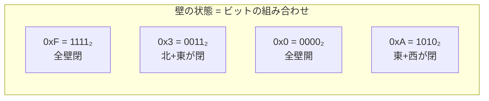
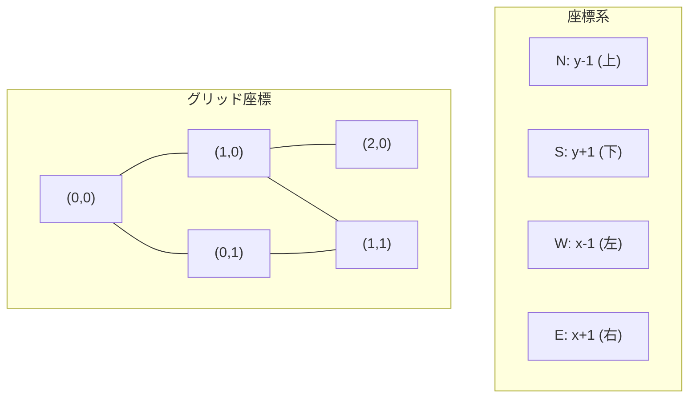
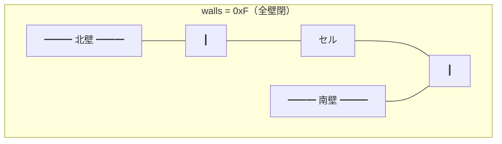
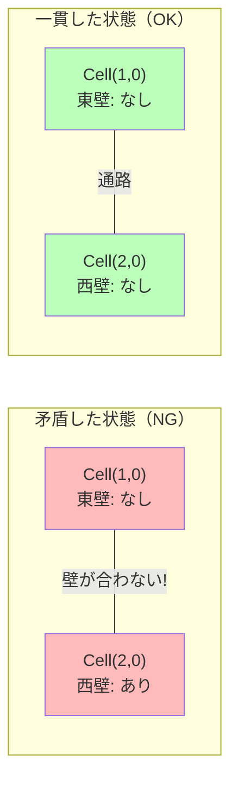

# データモデル

`mazegen/maze.py` はプロジェクト全体の基盤です。ここで定義される3つの要素が全てのモジュールで使われます。

## Direction — 方向を表すビットフラグ

```python
class Direction(enum.IntFlag):
    N = 1   # 0001 — 北
    E = 2   # 0010 — 東
    S = 4   # 0100 — 南
    W = 8   # 1000 — 西
```

### なぜ IntFlag なのか？

`IntFlag` は**ビット演算**ができる enum です。1つのセルの壁状態を1つの整数で表現できます。



### ビット演算の例

```python
# 壁を追加（OR）
walls = Direction.N | Direction.S  # 北と南に壁 → 0101₂ = 5

# 壁を除去（AND NOT）
walls &= ~Direction.N              # 北の壁を除去 → 0100₂ = 4

# 壁があるか確認（AND）
has_north = bool(walls & Direction.N)  # False
has_south = bool(walls & Direction.S)  # True
```

### 方向の補助データ

```python
# 反対方向のマッピング
OPPOSITE = {N: S, S: N, E: W, W: E}

# 各方向の移動量 (dx, dy)
DIRECTION_DELTA = {N: (0,-1), E: (1,0), S: (0,1), W: (-1,0)}
```



> **注意**: y軸は下向きが正です。数学の座標系とは逆です。これはグリッド（行列）の慣習に従っています。

## Cell — 1つのマス

```python
@dataclass
class Cell:
    x: int              # 列番号（左から右）
    y: int              # 行番号（上から下）
    walls: Direction     # どの壁が閉じているか（ビットマスク）
```

### セルの壁の視覚的な理解

```
         N (bit 0)
        +---+
 W      |   |      E
(bit 3) |   | (bit 1)
        +---+
         S (bit 2)
```



### 初期状態

全てのセルは `walls = 0xF`（全壁閉）で作成されます。アルゴリズムが壁を除去して通路を掘ります。

```
生成前（全壁閉）:          生成後（通路あり）:
+--+--+--+                +--+--+--+
|  |  |  |                |     |  |
+--+--+--+                +  +--+  +
|  |  |  |                |  |     |
+--+--+--+                +--+--+--+
```

## Maze — 迷路グリッド全体

```python
class Maze:
    width: int                              # 列数
    height: int                             # 行数
    entry: tuple[int, int]                  # 入口座標
    exit_: tuple[int, int]                  # 出口座標
    pattern_cells: set[tuple[int, int]]     # "42" パターンのセル
    _grid: list[list[Cell]]                 # 2次元配列
```

### 重要: `remove_wall()` の壁一貫性保証

隣接する2つのセルは壁を**共有**しています。片方だけ壁を除去すると矛盾が起きます。



`remove_wall()` は**必ず両側を同時に更新**します:

```python
def remove_wall(self, x, y, direction):
    # 自分の壁を除去
    cell.walls &= ~direction

    # 隣のセルの反対側の壁も除去
    neighbor.walls &= ~OPPOSITE[direction]
```

これにより、壁の矛盾は**構造的に発生不可能**になります。

### 主要メソッド一覧

| メソッド | 説明 |
|---------|------|
| `get_cell(x, y)` | 座標からセルを取得 |
| `has_wall(x, y, d)` | 特定の壁があるか確認 |
| `remove_wall(x, y, d)` | 壁を除去（両側同時） |
| `add_wall(x, y, d)` | 壁を追加（両側同時） |
| `neighbors(x, y)` | 範囲内の隣接セルを取得 |
| `accessible_neighbors(x, y)` | 壁のない方向の隣接セルを取得 |
| `iter_cells()` | 全セルをフラットに走査 |
| `row(y)` | 指定行の全セルを取得 |
