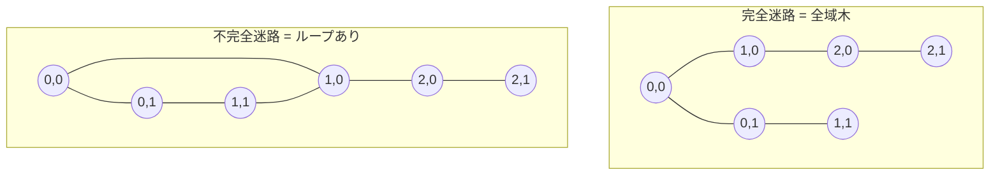
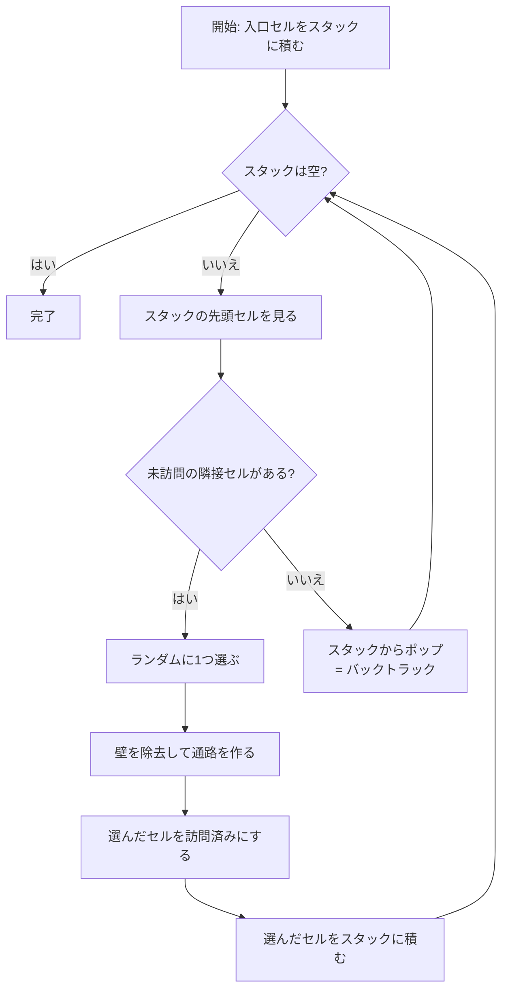
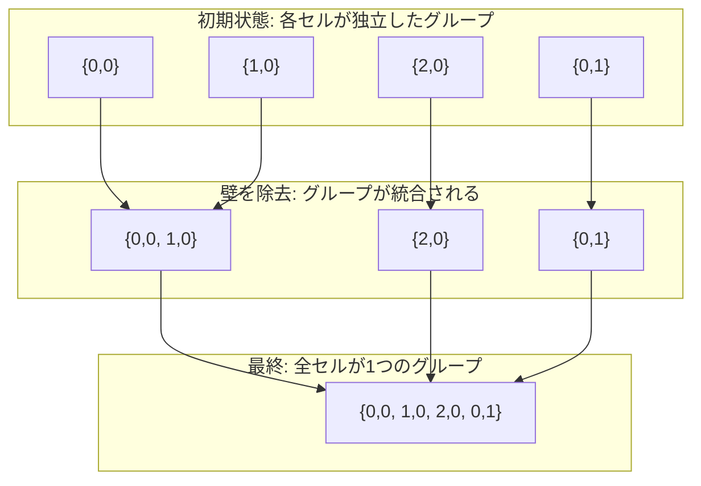
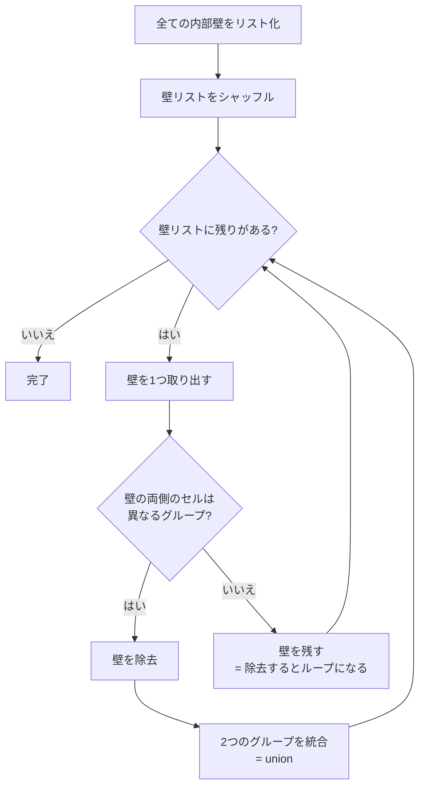
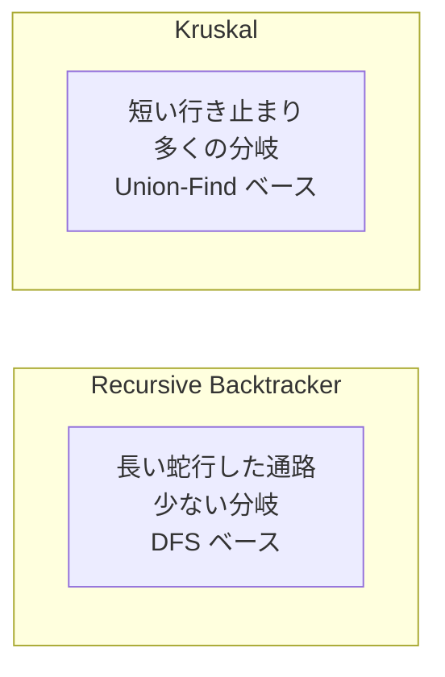
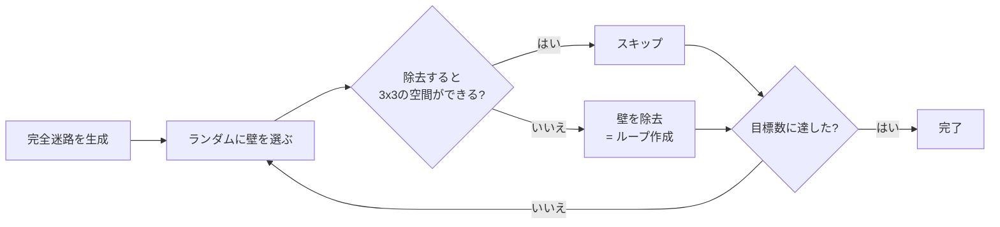

# 迷路生成アルゴリズム

## 前提知識: 完全迷路とグラフ理論

迷路は**グラフ**として捉えることができます:
- **ノード** = 各セル
- **辺** = 隣接セル間の通路（壁が除去された箇所）

**完全迷路**（perfect maze）とは、任意の2点間に**正確に1つの経路**しか存在しない迷路です。グラフ理論では、これは**全域木**（spanning tree）に相当します。



## アルゴリズム 1: Recursive Backtracker（反復的 DFS）

### 概要

深さ優先探索（DFS）を使って迷路を掘ります。「できるだけ深く進み、行き止まりになったら戻る」という戦略です。

### アルゴリズムの手順



### ステップバイステップの例（3x3 迷路）

```
初期状態（全壁閉）:       Step 1: (0,0)から開始
+--+--+--+               +--+--+--+
|  |  |  |               |@@|  |  |     @@ = 現在地
+--+--+--+               +--+--+--+     スタック: [(0,0)]
|  |  |  |               |  |  |  |
+--+--+--+               +--+--+--+
|  |  |  |               |  |  |  |
+--+--+--+               +--+--+--+

Step 2: 南に進む           Step 3: 東に進む
+--+--+--+               +--+--+--+
|  |  |  |               |  |  |  |
+  +--+--+               +  +--+--+
|@@|  |  |               |  @@|  |     壁を除去して進む
+--+--+--+               +--+  +--+
|  |  |  |               |  |  |  |
+--+--+--+               +--+--+--+
スタック: [(0,0),(0,1)]    スタック: [(0,0),(0,1),(1,1)]

Step 4: 行き止まり → バックトラック
全ての隣接セルが訪問済みならポップして戻る
```

### なぜ「反復的」DFS なのか？

Python には**再帰の深さ制限**（デフォルト1000）があります。100x100の迷路は10,000セルあるため、再帰だとクラッシュします。明示的な `list` をスタックとして使うことでこの制限を回避します。

```python
# NG: 再帰（大きな迷路でクラッシュ）
def generate_recursive(x, y):
    for neighbor in get_unvisited_neighbors(x, y):
        generate_recursive(nx, ny)  # RecursionError!

# OK: 反復的（スタックを明示的に管理）
stack = [(start_x, start_y)]
while stack:
    cx, cy = stack[-1]
    # ...
```

### 特徴

| 項目 | 値 |
|------|-----|
| 生成する迷路 | 完全迷路（自然に） |
| 通路の傾向 | 長く曲がりくねった通路 |
| 時間計算量 | O(幅 x 高さ) |
| 空間計算量 | O(幅 x 高さ) |

---

## アルゴリズム 2: Kruskal のアルゴリズム

### 概要

全ての壁を「辺」とみなし、ランダムに壁を選んで除去します。ただし、**既に繋がっているセル間の壁は除去しない**（ループ防止）。

これには **Union-Find**（素集合）というデータ構造を使います。

### Union-Find とは？

「どのセルが同じグループに属するか」を高速に管理するデータ構造です。



### アルゴリズムの手順



### Union-Find の2つの最適化

```python
class _UnionFind:
    def find(self, x):
        # パス圧縮: 親を直接ルートに繋ぎ直す
        while self._parent[x] != x:
            self._parent[x] = self._parent[self._parent[x]]
            x = self._parent[x]
        return x

    def union(self, a, b):
        # ランクによる統合: 低い木を高い木の下に付ける
        ra, rb = self.find(a), self.find(b)
        if ra == rb:
            return False  # 既に同じグループ
        if self._rank[ra] < self._rank[rb]:
            ra, rb = rb, ra
        self._parent[rb] = ra
        return True
```

### 特徴

| 項目 | 値 |
|------|-----|
| 生成する迷路 | 完全迷路 |
| 通路の傾向 | 短い行き止まり、多くの分岐 |
| 時間計算量 | O(幅 x 高さ x α) ※αはほぼ定数 |
| 空間計算量 | O(幅 x 高さ) |

---

## アルゴリズムの比較



| 比較項目 | Recursive Backtracker | Kruskal |
|---------|----------------------|---------|
| 通路の長さ | 長い | 短い |
| 分岐の頻度 | 少ない | 多い |
| 見た目の印象 | 川のように流れる | 樹木のように広がる |
| 実装の複雑さ | 低い | 中（Union-Find が必要） |
| 学習ポイント | DFS、スタック | 素集合、グラフ理論 |

## 不完全迷路の生成

`PERFECT=False` の場合、完全迷路を生成した後に**追加で壁を除去**してループを作ります。



全壁の約7%をランダムに除去しますが、3x3以上の開放エリアができないよう制約を守ります。
