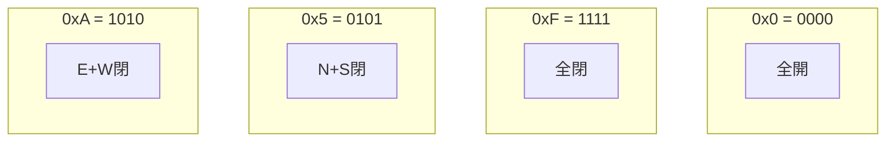
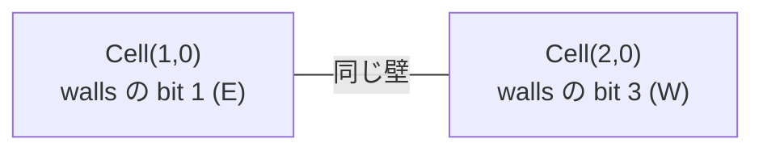

# 16進数壁エンコーディング

## 基本概念

迷路の各セルは**1つの16進数**（0〜F）で表現されます。この1桁が、そのセルの4方向の壁の開閉状態を全てエンコードしています。

## ビットと方向の対応

```
ビット3  ビット2  ビット1  ビット0
  W        S        E        N
 (西)     (南)     (東)     (北)
```

| ビット | 方向 | 値 |
|--------|------|------|
| 0 (LSB) | 北 (N) | 1 |
| 1 | 東 (E) | 2 |
| 2 | 南 (S) | 4 |
| 3 (MSB) | 西 (W) | 8 |

- **ビットが 1** = 壁が**閉じている**
- **ビットが 0** = 壁が**開いている**（通路）

## 具体例

### 例 1: 全壁閉 = `F`

```
     壁あり (N)
    +---+
壁  |   |  壁
(W) |   | (E)
    +---+
     壁あり (S)

2進数: 1111 = W + S + E + N = 8 + 4 + 2 + 1 = 15 = 0xF
```

### 例 2: 南と西が開いている = `3`

```
     壁あり (N)
    +---+
通路 |   |  壁あり (E)
    |   |
    +   +
     通路 (S)

閉じている壁: N + E = 1 + 2 = 3 = 0x3
```

### 例 3: 東と西が閉じている = `A`

```
     通路 (N)
    +   +
壁  |   |  壁
(W) |   | (E)
    +   +
     通路 (S)

閉じている壁: E + W = 2 + 8 = 10 = 0xA
```

## 全16パターン早見表



| 16進 | 2進 | 閉じている壁 | 図 |
|------|------|------------|-----|
| `0` | `0000` | なし | `+   +`<br/>`     `<br/>`+   +` |
| `1` | `0001` | N | `+---+`<br/>`     `<br/>`+   +` |
| `2` | `0010` | E | `+   +`<br/>`    \|`<br/>`+   +` |
| `3` | `0011` | N, E | `+---+`<br/>`    \|`<br/>`+   +` |
| `4` | `0100` | S | `+   +`<br/>`     `<br/>`+---+` |
| `5` | `0101` | N, S | `+---+`<br/>`     `<br/>`+---+` |
| `6` | `0110` | E, S | `+   +`<br/>`    \|`<br/>`+---+` |
| `7` | `0111` | N, E, S | `+---+`<br/>`    \|`<br/>`+---+` |
| `8` | `1000` | W | `+   +`<br/>`\|    `<br/>`+   +` |
| `9` | `1001` | N, W | `+---+`<br/>`\|    `<br/>`+   +` |
| `A` | `1010` | E, W | `+   +`<br/>`\|   \|`<br/>`+   +` |
| `B` | `1011` | N, E, W | `+---+`<br/>`\|   \|`<br/>`+   +` |
| `C` | `1100` | S, W | `+   +`<br/>`\|    `<br/>`+---+` |
| `D` | `1101` | N, S, W | `+---+`<br/>`\|    `<br/>`+---+` |
| `E` | `1110` | E, S, W | `+   +`<br/>`\|   \|`<br/>`+---+` |
| `F` | `1111` | 全て | `+---+`<br/>`\|   \|`<br/>`+---+` |

## Direction(IntFlag) との対応

このプロジェクトでは `Direction` enum の値がビット仕様と**完全に一致**するように設計されています:

```python
class Direction(IntFlag):
    N = 1   # bit 0 — 課題仕様のビット0
    E = 2   # bit 1 — 課題仕様のビット1
    S = 4   # bit 2 — 課題仕様のビット2
    W = 8   # bit 3 — 課題仕様のビット3
```

つまり、`cell.walls` の整数値を16進表記に変換するだけで出力ファイルが作れます:

```python
# 変換ロジックが不要！
hex_char = format(int(cell.walls), 'X')  # 例: 15 → 'F', 10 → 'A'
```

## 出力ファイルの構造

```
9515391539551795151151153     ← 1行目: y=0 の全セル（左から右）
EBABAE812853C1412BA812812     ← 2行目: y=1 の全セル
...                           ← 各行が迷路の1行分
                              ← 空行
0,0                           ← 入口座標 (x, y)
19,14                         ← 出口座標 (x, y)
SWSESWSESWSSSSEESEE...        ← 最短経路（N/E/S/W の文字列）
```

## 壁の一貫性

隣接するセルは壁を**共有**します。例えば:

```
Cell(1,0) の東壁 = Cell(2,0) の西壁
```



`Maze.remove_wall()` がこの一貫性を自動的に保証するため、出力ファイルで矛盾が起きることはありません。
