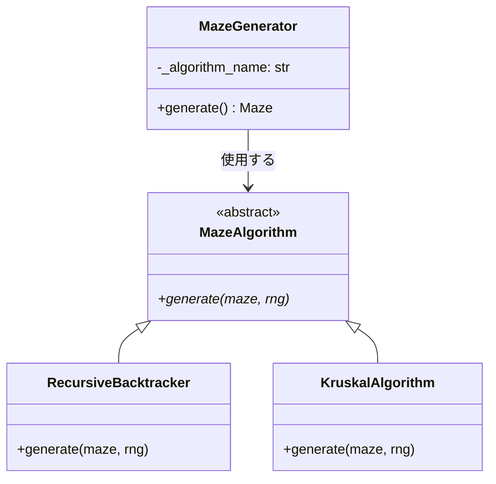
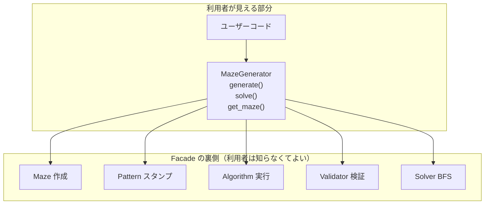
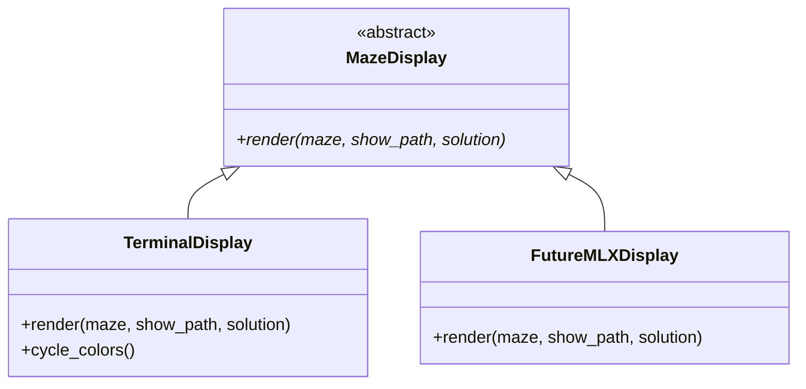
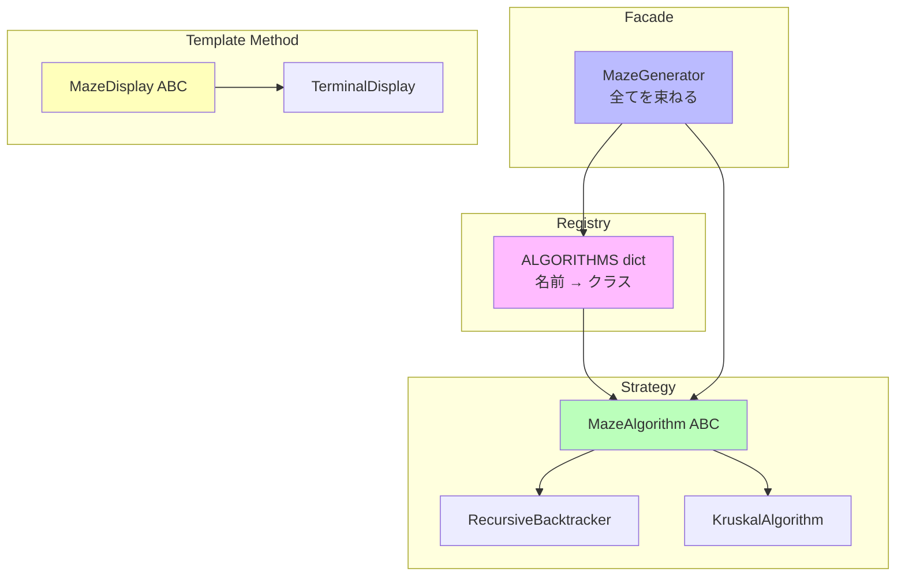

# デザインパターン

このプロジェクトで使われている設計パターンを解説します。パターンは「よくある問題への定番の解決策」であり、名前を知っていると設計意図を素早く伝えられます。

## 1. Strategy パターン — アルゴリズムの切り替え

### 問題

迷路の生成アルゴリズムを複数実装し、設定ファイルから切り替えたい。アルゴリズムを追加するたびに `if/elif` の分岐が増えるのは避けたい。

### 解決策

共通のインターフェース（ABC）を定義し、各アルゴリズムがそれを実装する。



### コードでの実現

```python
# base.py — 共通インターフェース
class MazeAlgorithm(ABC):
    @abstractmethod
    def generate(self, maze: Maze, rng: random.Random) -> None: ...

# recursive_backtracker.py — 具体的な実装 A
class RecursiveBacktracker(MazeAlgorithm):
    def generate(self, maze, rng):
        # DFS で通路を掘る

# kruskal.py — 具体的な実装 B
class KruskalAlgorithm(MazeAlgorithm):
    def generate(self, maze, rng):
        # Union-Find で通路を掘る
```

### 新アルゴリズムの追加方法

1. `MazeAlgorithm` を継承したクラスを書く
2. `ALGORITHMS` dict に登録する

```python
# 新しいアルゴリズム
class PrimAlgorithm(MazeAlgorithm):
    def generate(self, maze, rng): ...

# 登録（1行追加するだけ）
ALGORITHMS["prim"] = PrimAlgorithm
```

既存のコードを**一切変更せず**に新機能を追加できます。これを**開放閉鎖原則**（OCP: Open-Closed Principle）と言います。

---

## 2. Facade パターン — 複雑さの隠蔽

### 問題

迷路の生成には多くのステップがある（Maze作成 → パターンスタンプ → アルゴリズム実行 → バリデーション → BFS解法）。利用者がこれら全てを知る必要はない。

### 解決策

`MazeGenerator` が全てを束ねる窓口（ファサード）になる。



### コード例

```python
# 利用者はこれだけ書けばよい
gen = MazeGenerator(width=20, height=15, entry=(0,0), exit_=(19,14))
maze = gen.generate()  # 裏で5つのステップが実行される
path = gen.solve()     # BFS が走る
```

---

## 3. Registry パターン — 名前による発見

### 問題

設定ファイルの文字列 `"recursive_backtracker"` から、対応するクラスを見つけたい。

### 解決策

辞書でマッピングする。

```python
ALGORITHMS: dict[str, type[MazeAlgorithm]] = {
    "recursive_backtracker": RecursiveBacktracker,
    "kruskal": KruskalAlgorithm,
}

# 使う側
algo_class = ALGORITHMS[config.algorithm]
algo = algo_class()
algo.generate(maze, rng)
```

```mermaid
graph LR
    Config["config.txt<br/>ALGORITHM=kruskal"] -->|文字列| Registry["ALGORITHMS dict"]
    Registry -->|クラス| Instance["KruskalAlgorithm()"]
    Instance -->|generate()| Maze["迷路が生成される"]
```

### なぜ if/elif ではないのか？

```python
# NG: アルゴリズムが増えるたびに分岐が増える
if name == "recursive_backtracker":
    algo = RecursiveBacktracker()
elif name == "kruskal":
    algo = KruskalAlgorithm()
elif name == "prim":       # 追加のたびに...
    algo = PrimAlgorithm() # ここを変更する必要がある

# OK: dict に1行追加するだけ
algo = ALGORITHMS[name]()
```

---

## 4. Template Method パターン — 共通インターフェース

### 問題

ターミナル表示と将来のグラフィカル表示（MLX）で、同じ操作（render）を異なる方法で実現したい。

### 解決策

ABC で共通インターフェースを定義し、各バックエンドが具体的な実装を提供する。



`Controller` は `MazeDisplay` の型だけ知っていればよく、具体的な表示方法を知る必要がありません。

---

## パターンの関係まとめ



## 初学者へのアドバイス

1. **Strategy** — 「同じ操作を異なる方法で」と感じたら使う
2. **Facade** — 「手順が多すぎて使いにくい」と感じたら使う
3. **Registry** — 「文字列からクラスを探したい」と感じたら使う
4. **Template Method** — 「共通の形だけ決めて中身は後で」と感じたら使う

パターンは**目的**から考えるもので、「使うこと自体」が目的ではありません。このプロジェクトでは、それぞれのパターンに明確な理由があって採用されています。
