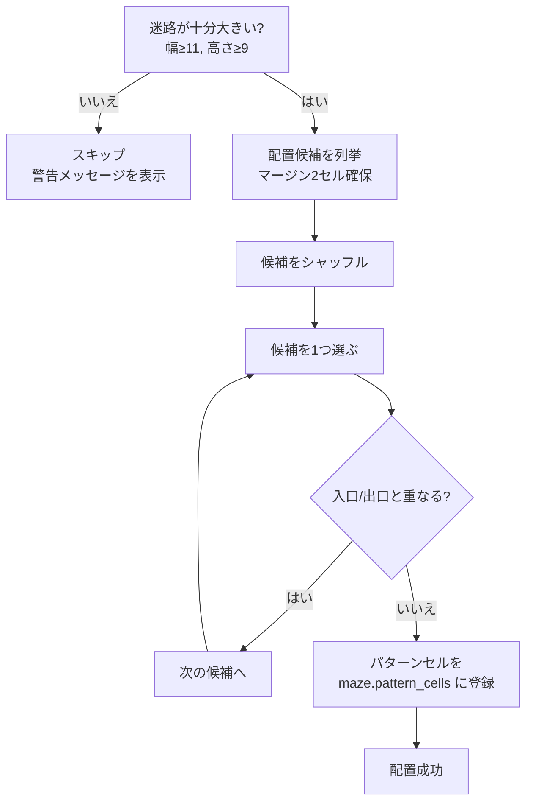
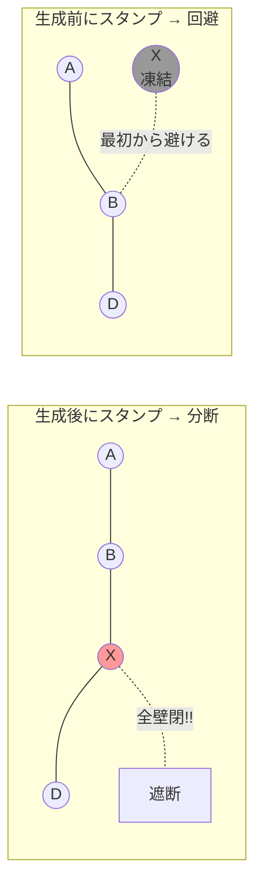

# 「42」パターンの配置

## 概要

迷路内に数字「42」を**完全に閉じたセル**（全4方向に壁あり = 0xF）で描画します。これらのセルは通路のない「島」になります。

## パターンのビットマップ

「4」と「2」はそれぞれ 3列 x 5行 で定義されています:

```
"4":     "2":
#.#      ###
#.#      ..#
###      ###
..#      #..
..#      ###

# = 閉じたセル（walls = 0xF）
. = 通常のセル（アルゴリズムが掘る）
```

2つの数字の間に1列のギャップを置き、合計 **7列 x 5行** です:

```
#.#.###
#.#...#
###.###
..#.#..
..#.###
```

## 配置フロー



## なぜ生成**前**にスタンプするのか？

### 生成後にスタンプした場合の問題

完全迷路（全域木）では、任意のセルを通過する経路が必ず存在します。セルの壁を全て閉じると、その経路が遮断され、迷路が**分断**されます。



### 生成前にスタンプする流れ

1. パターンセルの位置を決定し `maze.pattern_cells` に登録
2. アルゴリズムが**パターンセルをスキップ**して迷路を生成
3. パターンセルは全壁閉のまま残る（初期状態が 0xF なので操作不要）

```python
# recursive_backtracker.py 内
frozen = maze.pattern_cells
unvisited = [
    (nx, ny, d)
    for nx, ny, d in maze.neighbors(cx, cy)
    if (nx, ny) not in visited and (nx, ny) not in frozen  # ← ここ
]
```

## 最小サイズの制約

パターン自体が 7x5 で、上下左右に2セルのマージンを確保するため:

```
最小幅  = 7 + 2 + 2 = 11
最小高さ = 5 + 2 + 2 = 9
```

これより小さい迷路ではパターンを省略し、コンソールに警告を出力します。

## 表示での見え方

ターミナル表示では、パターンセルは `#` 記号で表示され、専用の色が付きます:

```
+--+--+--+--+--+--+--+--+--+
|     |  #  |  #  #  #  |  |
+  +--+  +--+  +--+--+--+  +
|  |  #  |  #  |        |  |
+  +  +--+  +--+  +--+  +  +
|  |  #  #  #  #  #  #  |  |
+--+  +--+--+  +--+--+  +--+
|     |     #  #        |  |
+  +--+  +  +--+--+--+  +  +
|  |     #  #  #  #  |     |
+--+--+--+--+--+--+--+--+--+
```
