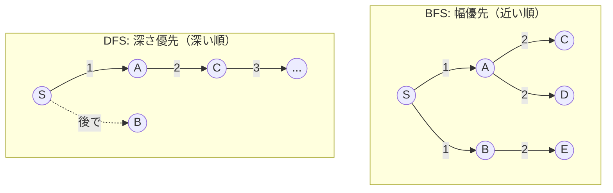
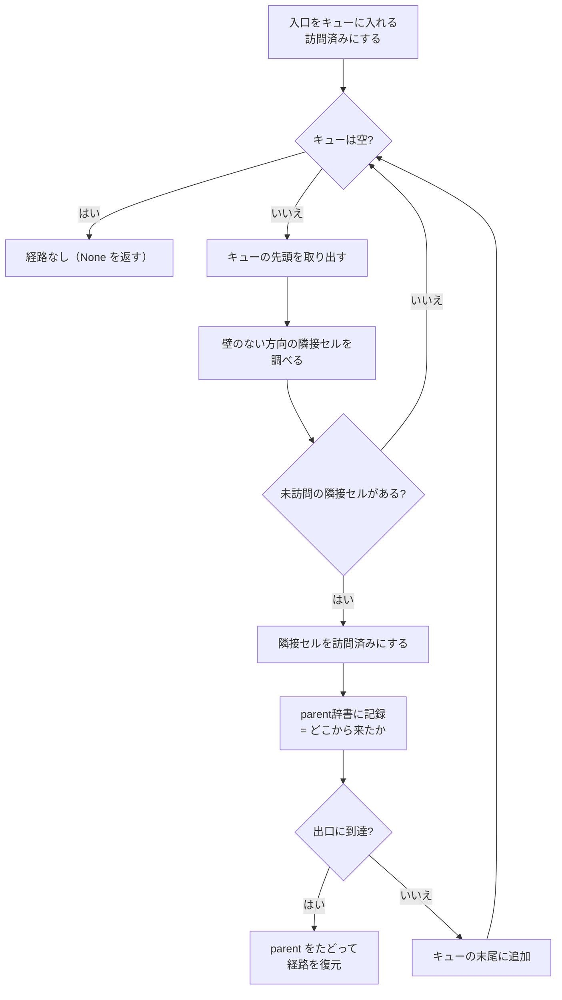
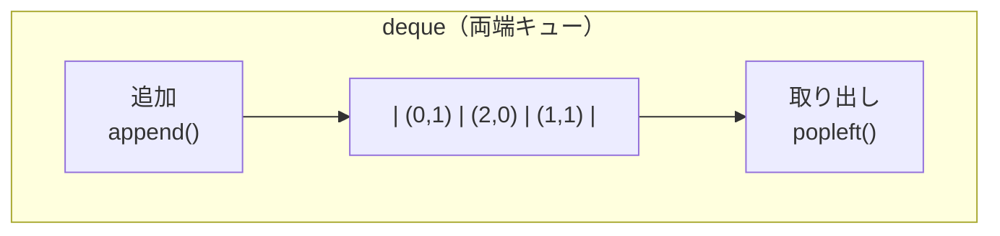
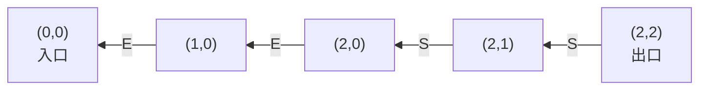

# BFS 最短経路探索

## BFS とは

**BFS**（Breadth-First Search / 幅優先探索）は、始点から近い順にノードを探索するアルゴリズムです。重みなしグラフ（全ての辺のコストが同じ）では、**最短経路を保証**します。

## DFS との違い



| | BFS | DFS |
|-|-----|-----|
| 探索順 | 近い → 遠い | 深い → 浅い |
| 最短経路 | 保証される | 保証されない |
| データ構造 | キュー (FIFO) | スタック (LIFO) |
| 用途 | 最短経路探索 | 迷路生成 |

## アルゴリズムの手順



## ステップバイステップの例

3x3 の迷路で (0,0) → (2,2) の最短経路を探す:

```
+--+--+--+
|S       |      S = 入口 (0,0)
+  +--+  +      E = 出口 (2,2)
|  |     |
+  +  +--+
|     |E |
+--+--+--+
```

### Step 1: 初期化

```
キュー:  [(0,0)]
訪問済み: {(0,0)}
parent:  {}
```

### Step 2: (0,0) を処理

壁のない方向を確認 → 東(1,0)と南(0,1)に進める

```
キュー:  [(1,0), (0,1)]
訪問済み: {(0,0), (1,0), (0,1)}
parent:  {(1,0): ((0,0), E), (0,1): ((0,0), S)}
```

### Step 3: (1,0) を処理

東(2,0)に進める

```
キュー:  [(0,1), (2,0)]
訪問済み: {(0,0), (1,0), (0,1), (2,0)}
parent:  {..., (2,0): ((1,0), E)}
```

### Step 4-6: 続行...

BFS は**近い順に探索**するため、(0,0)から距離2のセルを全て処理してから距離3のセルに進みます。

### Step N: (2,2) に到達!

```
parent をたどる:
  (2,2) ← S ← (2,1) ← S ← (2,0) ← E ← (1,0) ← E ← (0,0)

逆順にして経路を得る: E, E, S, S
```

## キュー（deque）の仕組み

BFS には **FIFO**（First In, First Out）のデータ構造が必要です:



```python
from collections import deque

queue = deque([(0, 0)])       # 初期化
queue.append((1, 0))          # 末尾に追加: O(1)
current = queue.popleft()     # 先頭から取り出し: O(1)
```

`list` の `pop(0)` は O(n) ですが、`deque.popleft()` は **O(1)** です。大きな迷路では重要な違いです。

## parent 辞書による経路復元

```python
# parent の型: 各セルに「どこから、どの方向で来たか」を記録
parent: dict[tuple[int,int], tuple[tuple[int,int], Direction]]

# 経路復元: 出口から入口へ逆にたどる
path = []
current = goal
while current != start:
    prev, direction = parent[current]
    path.append(direction)
    current = prev
path.reverse()  # 入口→出口の順に
```



逆順: `E → E → S → S` = 入口から出口への最短経路

## 計算量

| | 値 |
|-|-----|
| 時間計算量 | O(幅 x 高さ) — 各セルを最大1回訪問 |
| 空間計算量 | O(幅 x 高さ) — visited + parent + queue |

完全迷路では経路が1つしかないため BFS でも DFS でも同じ結果ですが、不完全迷路（ループあり）では BFS だけが最短を保証します。
