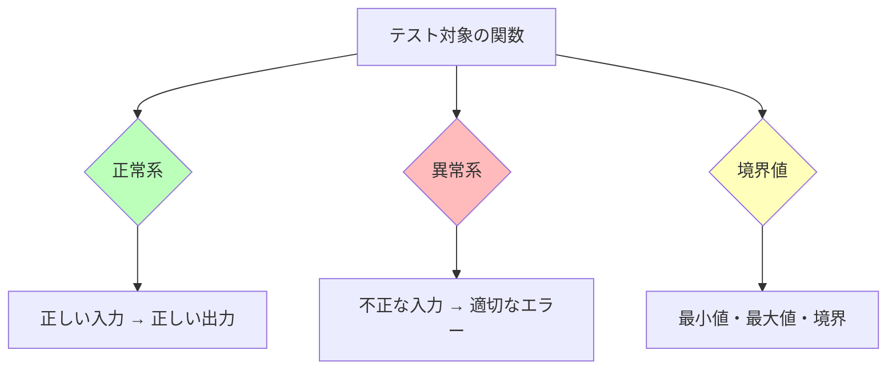

# テスト戦略

## テストの目的

テストは「コードが正しく動く」ことを**自動的に検証**する仕組みです。手動で毎回確認する代わりに、`make test` 1コマンドで全てチェックできます。

## テストの全体像


## テストファイルの構成

| テストファイル | テスト対象 | 検証内容 |
|-------------|----------|---------|
| `test_maze.py` | Direction, Maze | ビット値、壁の一貫性、境界チェック |
| `test_algorithms.py` | 各アルゴリズム | 有効な迷路の生成、シード再現性 |
| `test_solver.py` | BFS | 既知の迷路での経路、経路なしの場合 |
| `test_config.py` | 設定パーサー | 正常値、欠落キー、不正値 |

## テストの書き方

### 基本構造（Arrange-Act-Assert パターン）

```python
def test_remove_wall_coherence(self) -> None:
    # Arrange: テストの準備
    maze = Maze(5, 5, (0, 0), (4, 4))

    # Act: テスト対象の操作を実行
    maze.remove_wall(2, 2, Direction.E)

    # Assert: 期待する結果を検証
    assert not maze.has_wall(2, 2, Direction.E)   # 自分の壁が消えた
    assert not maze.has_wall(3, 2, Direction.W)    # 隣の壁も消えた
```

### 何をテストするか



### 正常系のテスト例

```python
def test_valid_config(self) -> None:
    """正しい設定ファイルが正しくパースされる"""
    cfg = parse_config(valid_config_path)
    assert cfg.width == 20
    assert cfg.height == 15
    assert cfg.entry == (0, 0)
```

### 異常系のテスト例

```python
def test_missing_key(self) -> None:
    """必須キーが欠けていたら ValueError"""
    with pytest.raises(ValueError, match="Missing required"):
        parse_config(incomplete_config_path)

def test_file_not_found(self) -> None:
    """存在しないファイルで FileNotFoundError"""
    with pytest.raises(FileNotFoundError):
        parse_config("/nonexistent/path.txt")
```

### 境界値のテスト例

```python
def test_boundary_check(self) -> None:
    """座標が範囲内/外かを正しく判定する"""
    maze = Maze(5, 5, (0, 0), (4, 4))
    assert maze.is_in_bounds(0, 0)      # 最小値 → True
    assert maze.is_in_bounds(4, 4)      # 最大値 → True
    assert not maze.is_in_bounds(-1, 0) # 範囲外 → False
    assert not maze.is_in_bounds(5, 0)  # 範囲外 → False
```

## 性質テスト（Property-based Testing）

特定の入力ではなく「どんな入力でも成り立つ性質」を検証します:

```python
def test_produces_valid_maze(self) -> None:
    """任意のシードで生成した迷路がバリデーションを通過する"""
    maze = Maze(15, 15, (0, 0), (14, 14))
    algo = RecursiveBacktracker()
    algo.generate(maze, random.Random(42))
    errors = validate_maze(maze)
    assert errors == []  # どんなシードでもエラーなし
```

```python
def test_seed_reproducibility(self) -> None:
    """同じシードから同じ迷路が生成される"""
    maze1 = Maze(10, 10, (0, 0), (9, 9))
    maze2 = Maze(10, 10, (0, 0), (9, 9))
    algo = RecursiveBacktracker()
    algo.generate(maze1, random.Random(123))
    algo.generate(maze2, random.Random(123))
    # 全セルの壁が一致する
    for y in range(10):
        for x in range(10):
            assert maze1.get_cell(x, y).walls == maze2.get_cell(x, y).walls
```

## 静的解析

テスト以外にも、コードの品質を保つツールがあります:

### flake8 — コーディング規約チェック

```bash
flake8 .
```

- インデント、行の長さ、未使用の import などをチェック
- PEP 8 に準拠しているか確認

### mypy — 型チェック

```bash
mypy . --strict
```

- 型ヒントの正確性を検証
- `--strict` は最も厳しいモード

```python
# mypy が検出するエラーの例
def solve(maze: Maze) -> list[Direction]:
    return None  # error: Incompatible return value type
                 # (got "None", expected "list[Direction]")
```

## テストの実行

```bash
# 全テスト実行
make test

# 特定のテストだけ実行
source .venv/bin/activate
pytest tests/test_maze.py -v

# 特定のテストクラスだけ
pytest tests/test_maze.py::TestDirection -v

# 特定のテストメソッドだけ
pytest tests/test_maze.py::TestDirection::test_bit_values -v
```

## テストの出力例

```
tests/test_maze.py::TestDirection::test_bit_values PASSED     [ 50%]
tests/test_maze.py::TestDirection::test_all_walls PASSED      [ 53%]
tests/test_maze.py::TestDirection::test_to_char PASSED        [ 57%]
tests/test_maze.py::TestMaze::test_remove_wall_coherence PASSED [ 67%]
...
============================== 28 passed in 0.06s ==============================
```

## テストを書くときの心得

1. **テスト名は「何を検証しているか」を明確にする** — `test_produces_valid_maze` は読むだけで意図が分かる
2. **1テスト1検証** — 複数のことを1つのテストで検証しない
3. **テスト同士は独立** — テストの実行順序に依存しない
4. **失敗メッセージを分かりやすく** — `assert errors == [], f"Validation errors: {errors}"`
